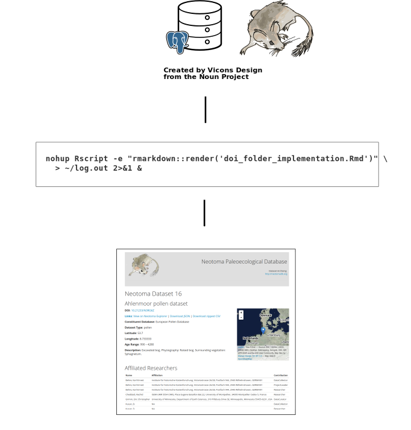

# landingPages

A repository specifically for generating RMarkdown landing pages for Neotoma Datasets

## Description

Each Neotoma dataset describes the site, site location and the data type found within the full data record.  The landing pages act as a link between the raw JSON or CSV formatted data and the DOI link for that dataset.  The also contain machine-readable JSON-LD text that can be used to help index pages within search engines or other online tools.

The Landing Page repository is built with consultation from [EarthCube Project 418](https://github.com/earthcubearchitecture-project418), a project that seeks to: "*[Use] HTML5 microdata to publish and harvest metadata on datasets using [schema.org]() and external vocabularies*".

Currently the workflow is wrapped in an RMarkdown document that provides some overview of the actual workflow process and provides limited summary statistics following successful completion.  The script pulls data from the Neotoma database directly using [SQL queries](https://github.com/NeotomaDB/landingPages/tree/master/sql_queries) and then formats them into a common standard for the landing page.  In addition, the `schema.org` vocabulary is used at the [base of each landing page](https://github.com/NeotomaDB/landingPages/blob/master/static_page.Rmd).

